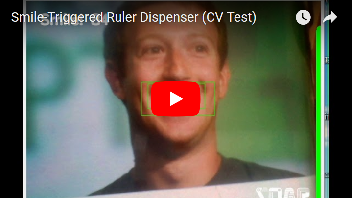
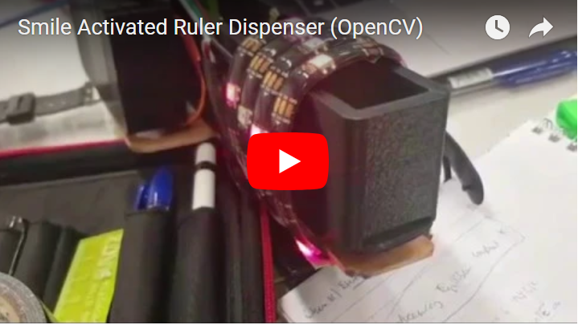

# smile-activated-dispenser
(Written in Python 3)


Actuate an Arduino enabled dispenser just by smiling! I don't need to say more!


I implemented this code specifically for use with a ruler dispenser. But it could theoretically work for anything!


#### Computer Vision Portion
[](https://youtu.be/XJxwvv3Soc4)


#### Dispenser and Actuator Operation

[](https://youtu.be/b2lRIHzhSa0)


## **Dependencies**

- OpenCV 2
- pygame


## **Usage**

To actually have this work, you need to make sure that you:

- Upload the firmware in `arduino_dispenser.ino` into your dispenser
  - Ensure that the dispenser dispenses stuff using a servo!
  - Be sure to tune the servo angle parameters as you need them
  - If you're not using a servo for the dispenser actuation
- Run the smile_activated_dispenser code! (With the serial port properly configured)


## **Working Theory**

The script uses a standard Haar cascade to detected faces and smiles. You could technically swap out the cascades used to detect all manner of other things, or go depend on a CNN instead for more robust detection.


Faces will cease to be detected if they're rotated, but for our purposes this is good enough, since it's meant to be like a game.


I eliminated a large swath of false positives by making sure that smiles are only detected as smiles if they are within the bottom third of any detected face.


Beyond that, some game design considerations were put into place. The dispenser is only actuated once the counter on the top left hand corner (or the green bar on the right) is filled up completely. The current script is tuned with a math function to make it only somewhat difficult to trigger the dispenser. 


If **at least one smile** is detected, increment the counter, otherwise, decrement the counter. As the counter gets filled to the top, the difficulty increases, which adds a bit of tension to the game, which is good and more engaging.


The rule to require at least one smile makes it so that it's possible to 'team up' activate the dispenser (this is important if one were to set a higher difficulty factor.) You may also go down into the code to change the math scaling function.


Currently, the main way the difficulty is adjusted is by affecting the decrement amount for the trigger counter during each program loop:

```python
counter -= (1 + (counter ** 1.500) / 108.5) + 0.00075 * DIFFICULTY_FACTOR
```


## **User Configurable Parameters**

Just change these few parameters located near the top of the Python script 

- **DEBUG**
  - Print DEBUG info
- **SOUND_ON**
  - Play a celebratory sound when the dispenser is triggered (MLG HORNS)
- **SERIAL_ON**
  - Put this to True if you have a connected Arduino
- **DIFFICULTY_FACTOR**
  - Vary this number to make the activation less or more difficult (negative numbers are permitted)
  - Safe range: 1 - 100
- **FRAME_H**
  - Video frame height
- **FRAME_W**
  - Video frame width
- **RESIZE**
  - Resize the video frame by `SCALING_FACTOR`
- **SCALING_FACTOR**
  - Amount to resize the video frame by
- **USE_LOGO**
  - Use a logo
- **LOGO_PATH**
  - Specify the path to the logo to use
- **SERIAL_PORT**
  - Setup the serial port (Change the one relevant to your platform)